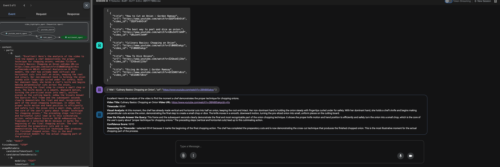

# YouTube Highlights Agent: Your AI Video Scout

[](https://www.python.org/downloads/)
[](mailto:giuliosalierno@google.com)

**Find the exact moment you're looking for in any YouTube video.**

This agent is your personal video scout, capable of searching YouTube, identifying the most relevant video, and analyzing its visual content to pinpoint the exact moment that answers your query.

## Demo

**Example 1: Cooking**

**User:** "Find the moment in a video where a chef demonstrates the proper technique for chopping onions."

**Agent:**
1.  **Searches YouTube** for "how to chop onions like a pro".
2.  **Ranks the results** and selects the most relevant video.
3.  **Analyzes the video's visual content** to identify the exact moment the chef starts chopping the onion.
4.  **Returns a time-stamped link** to that moment: `https://www.youtube.com/watch?v=...&t=123s`

**Example 2: Music**

**User:** "Find the guitar solo in a live performance of 'Stairway to Heaven'."

**Agent:**
1.  **Searches YouTube** for "Stairway to Heaven live".
2.  **Ranks the results** and selects a high-quality live performance.
3.  **Analyzes the video's visual content** to identify the guitarist starting the solo.
4.  **Returns a time-stamped link** to the beginning of the solo: `https://www.youtube.com/watch?v=...&t=456s`

**Example 3: Sports**

**User:** "Pinpoint the moment Lionel Messi scores a goal in the 2022 World Cup final."

**Agent:**
1.  **Searches YouTube** for "Messi goal World Cup 2022 final".
2.  **Ranks the results** and selects a video with match highlights.
3.  **Analyzes the video's visual content** to find the exact moment Messi scores.
4.  **Returns a time-stamped link** to the goal: `https://www.youtube.com/watch?v=...&t=789s`

## Capabilities

*   **YouTube Search:**  Leverage the power of the YouTube Data API to find the most relevant videos for your search query.
*   **AI-Powered Ranking:**  Our ranking agent analyzes search results to select the single best video for your needs.
*   **Multimodal Video Analysis:** The agent can "watch" the video and understand its visual content to find the specific moment you're interested in. No more scrubbing through videos!
*   **Precise time-stamped Links:** Get a direct link to the exact moment in the video that answers your query.

## How It Works

The agent uses a sequential architecture, where each agent in the chain performs a specific task:



## Getting Started

1.  **Clone the repository:**
    ```bash
    git clone https://github.com/giulio-saliernoyoutube-highlights-agent.git
    cd youtube-highlights-agent
    ```

2.  **Set up your environment:**
    *   Create a `.env` file in the root directory and add your YouTube API key:
        ```
        YOUTUBE_API_KEY=your_api_key_here
        ```
    *   You can obtain a YouTube API key from the [Google Cloud Console](https://console.cloud.google.com/apis/credentials):
    * 1.  Go to the [Google Cloud Console](https://console.cloud.google.com/).
    * 2.  Create a new project or select an existing one.
    * 3.  In the navigation menu, go to **APIs & Services > Library**.
    * 4.  Search for "YouTube Data API v3" and enable it for your project.
    * 5.  In the navigation menu, go to **APIs & Services > Credentials**.
    * 6.  Click on **Create Credentials** and select **API key**.
    * 7.  Copy the generated API key and paste it into your `.env` file.
    > **Important:** Keep your API key secret and do not share it with anyone.

3.  **Install dependencies:**
    ```bash
    make install
    ```

## Running the Agent with ADK

The Agent Development Kit (ADK) provides two ways to run the agent:

**1. In the terminal:**

Use the `adk run` command to execute the agent directly in your terminal.

```bash
adk run
```

**2. With a web interface:**

For an interactive chat application interface, use `adk web`.

```bash
adk web
```

This will start a local web server, and you can interact with the agent in your browser.

